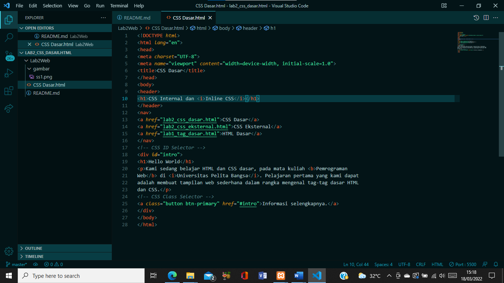
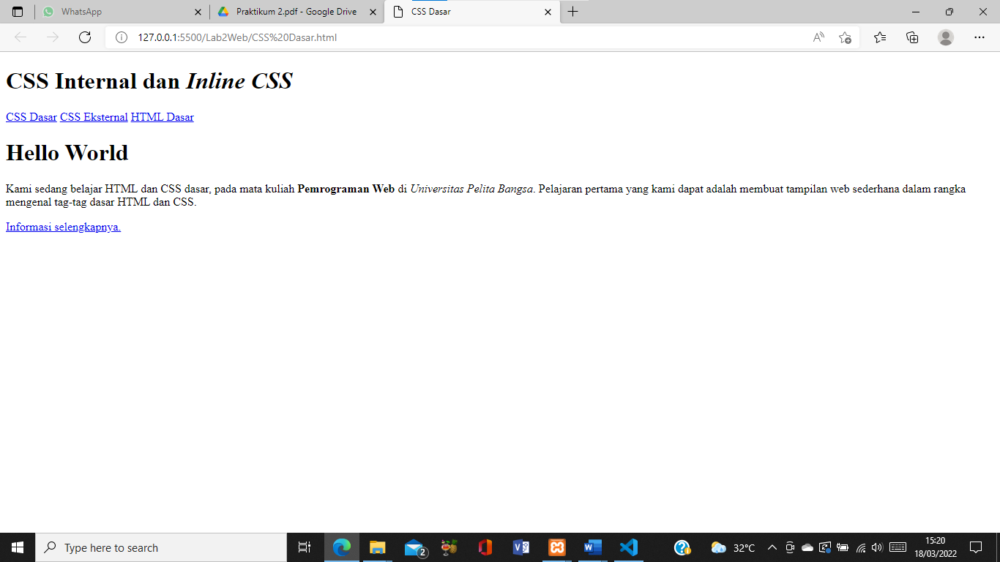

# Tugas Lab2 CSS Dasar HTML  
## Nama     : Nova Tegar Adiyansyah
## Nim      : 312010145
## Kelas    : TI.20.A.1 

# Langkah-langkah Praktikum 

Disini saya akan membuat langkah-langkah praktikum CSS dasar HTML menggunakan VScode : 

 
 

## 1. Membuat dokumen HTML  

Buatlah dokumen HTML seperti berikut : 

Selanjutnya buka pada browser<b> Google Chrome</b> untuk melihat hasilnya 

