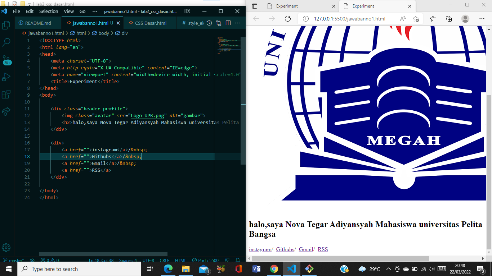
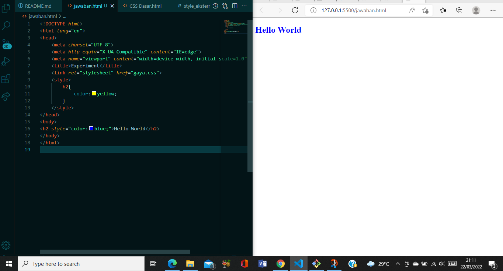
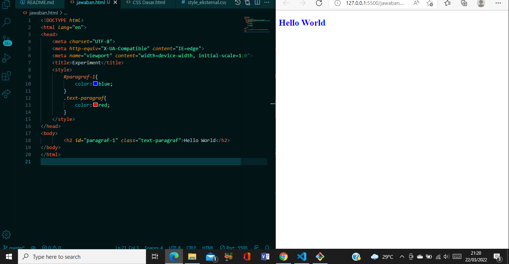

# Tugas Lab2 CSS Dasar HTML  

| Nova Tegar Adiyansyah | 312010145  |
|----------------- |----------- |
|  TI.20.A.1          | PROGRAM WEB|

# Langkah-langkah Praktikum 

Disini saya akan membuat langkah-langkah praktikum CSS dasar HTML menggunakan VScode : 

 
 

## 1. Membuat dokumen HTML  

Buatlah dokumen HTML seperti berikut : 

   

Selanjutnya buka pada browser<b> Google Chrome</b> untuk melihat hasilnya  

## 2. Mendeklarasikan CSS Internal  

Kemudian tambahkan deklarasi CSS internal seperti berikut pada bagian head dokumen  

  

Selanjutnya simpan perubahan yang ada, dan lakukan refresh pada browser untuk melihat 
hasilnya  

 

## 3. Menambahkan Inline CSS  

Kemudian tambahkan deklarasi inline CSS pada tag < p > seperti berikut :  

(

Simpan kembali dan refresh kembali browser untuk melihat perubahannya  

  

## 4. Membuat CSS Eksternal 

Buatlah file baru dengan nama style_eksternal.css kemudian buatlah deklarasi CSS seperti berikut :

 

Kemudian tambahkan tag < link > untuk merujuk file css yang sudah dibuat pada bagian < head >  

  

Selanjutnya refresh kembali browser untuk melihat hasilnya  

## 5. Menambahkan CSS Selector 

Selanjutnya menambahkan CSS Selector menggunakan ID dan Class Selector. Pada file 
style_eksternal.css, tambahkan kode berikut.

 

Kemudian simpan kembali dan refresh browser untuk melihat perubahannya 

 
 

## ========== TERIMAKASIH ========== ##

 

 

## Pertanyaan  

1. Lakukan eksperimen dengan mengubah dan menambah properti dan nilai pada kode CSS 
dengan mengacu pada CSS Cheat Sheet yang diberikan pada file terpisah dari modul ini.

2. Apa perbedaan pendeklarasian CSS elemen h1 {...} dengan #intro h1 {...}? berikan 
penjelasannya!

3. Apabila ada deklarasi CSS secara internal, lalu ditambahkan CSS eksternal dan inline CSS pada 
elemen yang sama. Deklarasi manakah yang akan ditampilkan pada browser? Berikan 
penjelasan dan contohnya!

4. Pada sebuah elemen HTML terdapat ID dan Class, apabila masing-masing selector tersebut 
terdapat deklarasi CSS, maka deklarasi manakah yang akan ditampilkan pada browser? 
Berikan penjelasan dan contohnya! ( < p id="paragraf-1" class="text-paragraf" > )

## Jawaban  

1. Saya akan mengubah dan menambah properti dan nilai pada kode CSS, dimulai dari membuat kerangka htmlnya. Seperti gambar berikut : Kemudian membuat CSSnya dengan menambahkan nilai dan properti pada kode diatas Disini Saya menambahkan 4 pemilih kedalam CSS, diantaranya body, h2, .avatar, .header-profile. Masing-masing memiliki fungsi untuk mengatur tampilan pada HTML 

 

2. Jadi jika mendeklarasikan h1 nya saja itu akan mengubah semua elemen {h1}, sedangkan jika mendeklarasikan {#intro h1} itu hanya mengubah elemen {h1} pada {#intro} saja.  

3. Jika mendeklarasikan Internal, Eksternal dan Inline secara bersamaan yang akan ditampilkan pada Browser adalah Inline, Karena Inline Memiliki prioritas dibanding Eksternal atau pun Internal. Saya akan membuat dokumen baru HTML, kemudian saya buat Elemen {h2}, kemudian saya deklarasikan di CSS Internal Eksternal dan juga Inline, dengan menggunakan properti {color} yang berbeda, jika Internal {color: yellow} sementara Eksternal {color: brown;} dan Inline {color: blue;} yang terpanggil dibrowser adalah Inline karena memiliki prioritas. Berikut contohnya : 

 

4. Yang ditampilkan dibrowser adalah ID, ID bersifat unik berbeda dengan Class, Class bisa digunakan banyak, sementara ID hanya tertentu saja, oleh karena itu ID yang ditampilkan dibrowser. 

