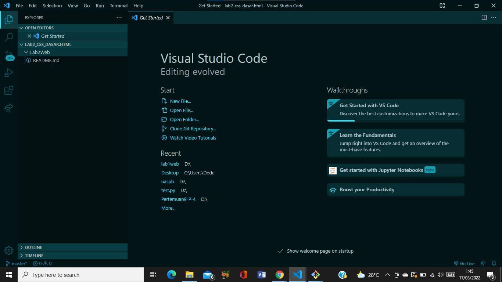

# Tugas Lab2 CSS Dasar HTML  
## Nama     : Nova Tegar Adiyansyah
## Nim      : 312010145
## Kelas    : TI.20.A.1 

# Langkah-langkah Praktikum 

Disini saya akan membuat langkah-langkah praktikum CSS dasar HTML menggunakan VScode : 

 
 

## 1. Membuat dokumen HTML  

Buatlah dokumen HTML seperti berikut : 

   

Selanjutnya buka pada browser<b> Google Chrome</b> untuk melihat hasilnya  

## 2. Mendeklarasikan CSS Internal  

Kemudian tambahkan deklarasi CSS internal seperti berikut pada bagian head dokumen  

  

Selanjutnya simpan perubahan yang ada, dan lakukan refresh pada browser untuk melihat 
hasilnya  

 

## 3. Menambahkan Inline CSS  

Kemudian tambahkan deklarasi inline CSS pada tag < p > seperti berikut :  

(

Simpan kembali dan refresh kembali browser untuk melihat perubahannya  

  

## 4. Membuat CSS Eksternal 

Buatlah file baru dengan nama style_eksternal.css kemudian buatlah deklarasi CSS seperti berikut :

 

Kemudian tambahkan tag < link > untuk merujuk file css yang sudah dibuat pada bagian < head >  

  

Selanjutnya refresh kembali browser untuk melihat hasilnya  

## 5. Menambahkan CSS Selector 

Selanjutnya menambahkan CSS Selector menggunakan ID dan Class Selector. Pada file 
style_eksternal.css, tambahkan kode berikut.

 

Kemudian simpan kembali dan refresh browser untuk melihat perubahannya 

